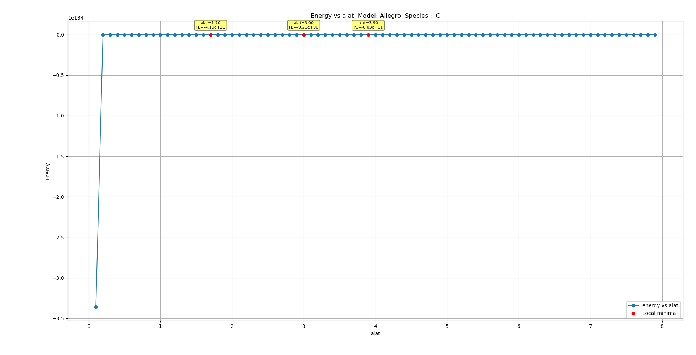
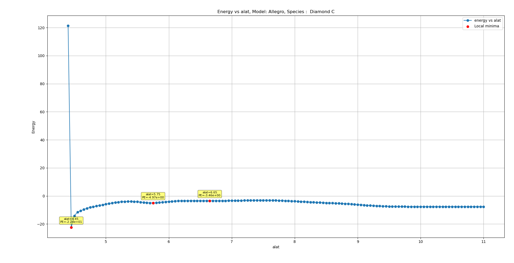
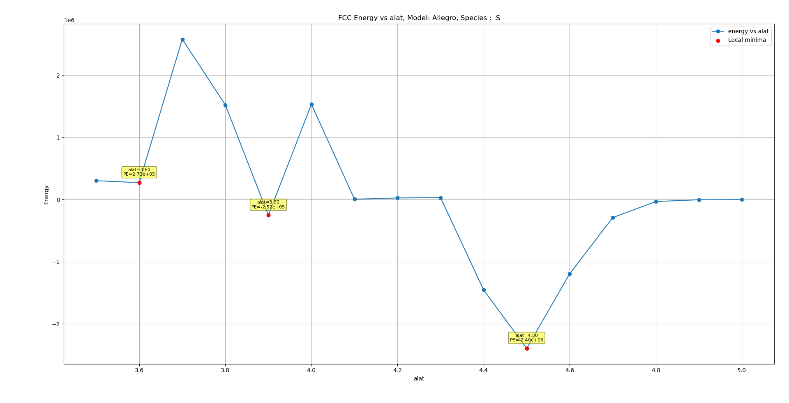

# "Good" Lattice Constant Range-Finder

<h3> Other models and species </h3>
 

<h3> Hydrogen </h3>

<h3> Carbon </h3>

<h3> Nitrogen </h3>

<h3> Oxygen </h3>

<h3> Sulphur </h3>

<h3> Mixed </h3>

# Energy vs bond-length relation

To confirm that our code (KIM-API wrapper) agrees with the original paper's results.\
This was also confirmed by directly executing the model parameter file (.pth file) using Torchscript.

# Energy vs lattice-constant for FCC  
Some of the plots span very wide energy scales so in some places I've resorted to manually inspecting the tabular data. 

## Carbon FCC
Local Energy minima at `alat = 1.70Å` of `-4.18 10^21 eV)`\
This is also the equilibrium `alat` for Carbon FCC during the Forces-Numerical-Derivative check. 

<table>
<tr><th>alat Å</th> <th> energy eV </th> </tr>
<tr><td>1.2 </td> <td>-9.32e+43</td></tr>
<tr><td>1.3 </td> <td>-6.05e+36</td></tr>
<tr><td>1.4 </td> <td>7.96e+30</td></tr>
<tr><td>1.5 </td> <td>7.06e+28</td></tr>
<tr><td>1.6 </td> <td>5.00e+25</td></tr>
<tr><td><b>1.7</b> </td> <td><b>-4.18e+21</b></td></tr>
<tr><td>1.8 </td> <td>-4.84e+19</td></tr>
<tr><td>1.9 </td> <td>-1.88e+17</td></tr>
<tr><td>1.0 </td> <td>-6.48e+15</td></tr>
</table>

<table>
<tr><th>alat Å</th> <th> energy eV </th> </tr>
<tr><td>2.5 </td> <td> -11.3 10^5 </td></tr>
<tr><td>2.6 </td> <td> -18.5 10^5</td></tr>
<tr><td>2.7 </td> <td> 9.02 10^4 </td></tr>
<tr><td>2.8 </td> <td> 1.28 10^4 </td></tr>
<tr><td>2.9 </td> <td> -5.33 10^5 </td></tr>
<tr><td><b>3.0</b> </td> <td><b>-9.21 10^6</b></td></tr>
<tr><td>3.1 </td> <td>-2.31 10^6</td></tr>
<tr><td>3.2 </td> <td>-4.43 10^3</td></tr>
<tr><td>3.3 </td> <td>-6.46 10^3</td></tr>
</table>

## Carbon Diamond
To check whether this was due to FCC structure we also tested Carbon Diamond 

It exhibits large negative energies at small distances, and settles down to `-7.63eV` at large distances. It has a local minima at `alat = 4.5` whereas expeimental results show `alat = 3.5`. 

## Hydrogen FCC
It has a local minima at `alat=2.6` with negative energy of `-56eV` but I'm not confident if the optimization method could pick it up.\
It also has a local minima at `alat=4.5` with positive energy `+2.1eV`.\
The long-range energy settles to `-122eV`

| alat (Å) | energy (eV)     |
|----------|-----------------|
| 2.1      | -1.6056e+09     |
| 2.2      | -2.9757e+08     |
| 2.3      | -1.0302e+07     |
| 2.4      | -3.3714e+04     |
| 2.5      | 1.6316e+02      |
|**2.6**      | **-5.6520e+01**|
| 2.7      | -1.9958e+01     |
| 2.8      | -1.1332e+01     |
| 2.9      | -1.5774e+01     |
| 3.0      | -1.9786e+00     |

## Nitrogen FCC

## Oxygen FCC

## Sulphur FCC

## Mixed FCC

# FCC simulation results for Allegro 
- All species have large negative energies at small distances.
- All species settled down to `-122eV` at large distances. 

# Magnitude of errmax in FND check for Carbon
Earlier when I was running the FND check, the derivative test was failing at alat = 1.7. 
But it's passing when I run it in isolation at alat = 1.7. Must re-run the FND check to confirm this behaviour. 
For carbon, the equilibtrium alat was 1.7Å. At that distance, the FND check would fail rescaling operations and the absolute values of the errors in force are of the order `10^13 eV/Å`. The relative values of errors are of the order of `10^-9` because the forces are of the order `10^22 eV/Å`

# Currently testing
- At what **N** does the N-body system's energy blow up to negative infinity? 
	- energy vs bond-length for triatomic molecules. 

<!-- # FCC lattice -->
<!-- visualize dump from ASE of equilibrium FCC carbon -->
